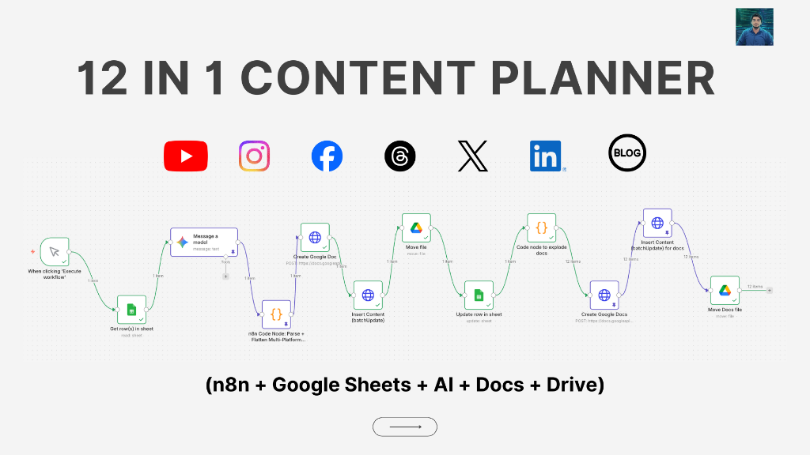

# 12 in 1 Content Planner (Complete)



A comprehensive n8n workflow for automated content planning and generation across multiple platforms.

> **🚀 Special Offer**: Get **20% off** if you host your n8n on Hostinger!  
> [**Click here to claim your discount**](https://hostinger.in?REFERRALCODE=AVNISH)


## Prerequisites

Here’s what you need to get started:

### ✅ Software/Services
- **n8n** (Self-hosted or Cloud)
- **Google Cloud Project** with the following APIs enabled:
  - Google Sheets API
  - Google Drive API
  - Google Docs API
- **AI Model API** (One of the following):
  - Google Gemini
  - DeepSeek
  - OpenAI

### ✅ Google API Scopes (Important)
For Google OAuth, make sure your credentials have these scopes allowed:
- **Google Sheets**: Read/Write (`https://www.googleapis.com/auth/spreadsheets`)
- **Google Drive**: Access (`https://www.googleapis.com/auth/drive`)
- **Google Docs**: Access (`https://www.googleapis.com/auth/documents`)

## Workflow Overview

### ✅ n8n Nodes Used
This workflow utilizes the following key nodes:
- **Manual Trigger / Cron Trigger**: To start the workflow manually or on a schedule.
- **Google Sheets (Read/Update)**: To fetch topics and update status.
- **HTTP Request**: For making AI calls and batch updates to Google Docs.
- **Code Node**: To parse the JSON response from the AI, build document structures, and flatten data for the sheet.
- **Item Lists / Code**: To split out or explode documents into individual items.
- **Google Drive**: To create folders and move generated files.

## System Prompt

You can use the following prompt in your AI model node to generate the content:

```text
You are an expert automation content creator. Generate a complete "12 in 1 Content Planner" content pack for ONE topic.

IMPORTANT OUTPUT RULES (MUST FOLLOW):
1) Output ONLY valid JSON. No markdown. No commentary. No trailing commas.
2) Use double quotes for all strings. Use only: string/number/boolean/array/object.
3) Language:
   - Hinglish for Reel voiceover + IG captions (natural, not cringe).
   - Simple English for Carousel slides (clean, punchy).
   - LinkedIn + Blog can be professional English (calm, engineering-led).
4) Avoid false claims. If something is uncertain, phrase it as a suggestion.
5) Carousel: exactly 10 slides. Each slide body must fit on screen (max 180 characters).
6) Instagram Reel: 35–45 seconds, 8–12 shots, timestamps + on-screen captions. First 2 shots must show payoff/demo quickly. Include 1 shot for error handling/retry/approval. End with CTA keyword.
7) YouTube Long: provide full voiceover script (6–9 minutes) + title + description + chapters + tags + pinned comment + thumbnail text ideas.
8) YouTube Short: provide 45–60 sec script (hook-heavy) + on-screen text beats + description + hashtags.
9) Provide a "validation" object with simple checks so n8n can fail fast.

INPUT (from Google Sheet row):
{
  "topic": "${$json.Title}",
  "cta_keyword": "FLOW",
  "lead_magnet": "12-in-1 Content Planner n8n JSON",
  "brand": {
    "channel_name": "CodeITronics / Avnish",
    "promise": "Build once. Automate forever.",
    "tone": "calm, confident, engineering-led; no hype"
  }
}

Return this exact JSON shape (do not change keys):

{
  "meta": {
    "topic": "",
    "content_angle": "",
    "primary_pain": "",
    "big_payoff": "",
    "audience": "developers building automations",
    "cta_keyword": "",
    "lead_magnet": ""
  },

  "youtube": {
    "long": {
      "title": "",
      "hook_1_line": "",
      "outline_bullets": [],
      "script": "",
      "description": "",
      "chapters": [
        { "t": "0:00", "label": "Intro / Demo" }
      ],
      "tags": [],
      "pinned_comment": "",
      "thumbnail": {
        "text_options": [],
        "visual_concept": "",
        "composition_notes": ""
      }
    },
    "short": {
      "title": "",
      "script": "",
      "on_screen_beats": [],
      "description": "",
      "hashtags": []
    }
  },

  "instagram": {
    "reel": {
      "duration_sec": 40,
      "hook_text": "",
      "shots": [
        {
          "t_start": "0:00",
          "t_end": "0:03",
          "visual": "",
          "on_screen_text": "",
          "voiceover_hinglish": "",
          "sfx": ""
        }
      ],
      "caption_hinglish": "",
      "hashtags": [],
      "cta_line": ""
    },
    "post": {
      "caption_hinglish": "",
      "hashtags": [],
      "cta_line": ""
    },
    "carousel": {
      "cover": { "headline": "", "subheadline": "", "badge": "" },
      "slides": [
        { "slide_no": 1, "title": "", "body": "", "on_screen_caption": "" },
        { "slide_no": 2, "title": "", "body": "", "on_screen_caption": "" },
        { "slide_no": 3, "title": "", "body": "", "on_screen_caption": "" },
        { "slide_no": 4, "title": "", "body": "", "on_screen_caption": "" },
        { "slide_no": 5, "title": "", "body": "", "on_screen_caption": "" },
        { "slide_no": 6, "title": "", "body": "", "on_screen_caption": "" },
        { "slide_no": 7, "title": "", "body": "", "on_screen_caption": "" },
        { "slide_no": 8, "title": "", "body": "", "on_screen_caption": "" },
        { "slide_no": 9, "title": "", "body": "", "on_screen_caption": "" },
        { "slide_no": 10, "title": "", "body": "", "on_screen_caption": "" }
      ],
      "design": {
        "format": "1080x1350",
        "style": "minimal, dev aesthetic",
        "colors": {
          "bg": "#0B1220",
          "text": "#FFFFFF",
          "accent1": "#7C3AED",
          "accent2": "#22C55E",
          "warning": "#F59E0B"
        },
        "font_suggestions": ["Poppins", "Inter"],
        "layout_rules": [
          "Max 2 lines title",
          "Body max 3 short lines",
          "Use 1 highlight word per slide",
          "Keep safe margins 10%"
        ]
      }
    }
  },

  "facebook": { "post": { "text": "", "cta_line": "" } },

  "threads": { "post": { "text": "" } },

  "twitter": {
    "post": { "text": "" },
    "thread": { "tweets": [] }
  },

  "linkedin": {
    "post": { "text": "", "cta_line": "" },
    "article": { "title": "", "hook": "", "tldr": "", "body": "", "hashtags": [] }
  },

  "blog": {
    "title": "",
    "slug": "",
    "tldr": "",
    "meta_title": "",
    "meta_description": "",
    "html_body": "",
    "tags": [],
    "image_prompt": ""
  },

  "assets": {
    "screen_recording_list": [],
    "broll_ideas": [],
    "thumbnail": {
      "text_options": [],
      "visual_concept": "",
      "composition_notes": ""
    }
  },

  "validation": {
    "is_valid_json": true,
    "carousel_slides_count": 10,
    "reel_has_8_to_12_shots": true,
    "safe_to_publish": true,
    "warnings": []
  }
}

Rules for generating Reel shots:
- Provide 8–12 shots total.
- First 2 shots must show payoff/demos quickly.
- Include 1 shot for error handling/retry/approval.
- End with CTA: comment "FLOW" to get "12-in-1 Content Planner n8n JSON".

Return ONLY the JSON.
```

## n8n Code Node Logic

This is the code used in the "Parse + Flatten Multi-Platform JSON Payload" node. It handles extracting the JSON from the LLM response, flattening the structure for Google Sheets, and preparing document jobs for Google Docs.

```javascript
/**
 * n8n Code Node: Parse + Flatten Multi-Platform JSON Payload
 *
 * Goal:
 * - Take the LLM JSON payload (already parsed OR raw text) and split/flatten into parts:
 *   YouTube Long/Short, Facebook Post, Instagram Reel/Post/Carousel,
 *   LinkedIn Post/Article, Blog Post, Twitter Post/Thread, Threads Post
 *
 * Outputs:
 * 1) One "master" item with flattened fields you can map to Google Sheets columns
 * 2) A "docs" array you can Split In Batches to create Google Docs in Drive
 *
 * How to use:
 * - Place after your LLM node (or after your JSON-validate node)
 * - If you already output payload at $json.payload, it will use that.
 * - If your LLM node output is raw text, it will attempt to extract JSON and parse it.
 */

function pickFirstString(obj) {
  if (obj == null) return null;
  if (typeof obj === "string") return obj;

  // Gemini
  try {
    const parts = obj?.candidates?.[0]?.content?.parts;
    if (Array.isArray(parts)) {
      const textPart = parts.find(p => typeof p?.text === "string");
      if (textPart?.text) return textPart.text;
    }
  } catch (e) {}

  // OpenAI-style
  try {
    const c = obj?.choices?.[0];
    if (typeof c?.message?.content === "string") return c.message.content;
    if (typeof c?.text === "string") return c.text;
  } catch (e) {}

  // Common
  for (const k of ["text", "content", "body", "data", "response", "result", "message", "output"]) {
    if (typeof obj?.[k] === "string") return obj[k];
    if (obj?.[k] && typeof obj[k] === "object") {
      const nested = pickFirstString(obj[k]);
      if (nested) return nested;
    }
  }

  return null;
}

function stripCodeFences(s) {
  return String(s || "")
    .replace(/```(?:json)?\s*/gi, "")
    .replace(/```/g, "")
    .trim();
}

function extractJsonObject(raw) {
  const s = stripCodeFences(raw);
  const start = s.indexOf("{");
  const end = s.lastIndexOf("}");
  if (start === -1 || end === -1 || end <= start) return null;
  return s.slice(start, end + 1);
}

function repairJson(s) {
  // minimal repairs
  return String(s || "")
    .replace(/[“”]/g, '"')
    .replace(/[‘’]/g, "'")
    .replace(/,\s*([}\]])/g, "$1");
}

function asString(x) {
  return typeof x === "string" ? x : (x == null ? "" : String(x));
}

function joinTags(arr) {
  if (!Array.isArray(arr)) return "";
  return arr.map(t => asString(t).trim()).filter(Boolean).join(", ");
}

function joinHashtags(arr) {
  if (!Array.isArray(arr)) return "";
  return arr
    .map(t => asString(t).trim())
    .filter(Boolean)
    .map(t => (t.startsWith("#") ? t : `#${t}`))
    .join(" ");
}

function mdBullet(arr) {
  if (!Array.isArray(arr) || !arr.length) return "";
  return arr.map(x => `- ${asString(x)}`).join("\n");
}

function renderCarouselText(carousel) {
  const cover = carousel?.cover || {};
  const slides = Array.isArray(carousel?.slides) ? carousel.slides : [];
  const design = carousel?.design || {};
  const slideLines = slides.map(s => {
    const no = s.slide_no ?? "";
    const title = asString(s.title);
    const body = asString(s.body);
    const osc = asString(s.on_screen_caption);
    return [
      `Slide ${no}: ${title}`.trim(),
      body,
      osc ? `On-screen: ${osc}` : "",
      ""
    ].filter(Boolean).join("\n");
  }).join("\n");

  return [
    `Cover Headline: ${asString(cover.headline)}`,
    `Cover Subheadline: ${asString(cover.subheadline)}`,
    `Cover Badge: ${asString(cover.badge)}`,
    "",
    "Slides:",
    slideLines,
    "",
    "Design:",
    `Format: ${asString(design.format)}`,
    `Style: ${asString(design.style)}`,
    `Colors: ${design.colors ? JSON.stringify(design.colors) : ""}`,
    `Fonts: ${Array.isArray(design.font_suggestions) ? design.font_suggestions.join(", ") : ""}`,
    `Layout Rules: ${Array.isArray(design.layout_rules) ? design.layout_rules.join(" | ") : ""}`,
  ].join("\n");
}

function renderReelShots(shots) {
  if (!Array.isArray(shots) || !shots.length) return "";
  return shots.map((s, i) => {
    return [
      `SHOT ${i + 1} (${asString(s.t_start)} - ${asString(s.t_end)})`,
      `Visual: ${asString(s.visual)}`,
      `On-screen: ${asString(s.on_screen_text)}`,
      `VO: ${asString(s.voiceover_hinglish || s.voiceover)}`,
      s.sfx ? `SFX: ${asString(s.sfx)}` : "",
      ""
    ].filter(Boolean).join("\n");
  }).join("\n");
}

function renderYTChapters(chapters) {
  if (!Array.isArray(chapters) || !chapters.length) return "";
  return chapters.map(c => `${asString(c.t)} — ${asString(c.label)}`).join("\n");
}

function htmlOrText(x) {
  // keep html as-is; otherwise string
  return asString(x);
}

// -------------------- MAIN: get payload --------------------
const inputItem = $input.first().json.content.parts[0].text
const extracted = extractJsonObject(inputItem);
let payload = JSON.parse(extracted);;

// -------------------- Extract Parts --------------------
const meta = payload.meta || {};
const youtubeLong = payload.youtube?.long || {};
const youtubeShort = payload.youtube?.short || {};
const instagramReel = payload.instagram?.reel || {};
const instagramPost = payload.instagram?.post || {};
const instagramCarousel = payload.instagram?.carousel || {};
const facebookPost = payload.facebook?.post || {};
const linkedinPost = payload.linkedin?.post || {};
const linkedinArticle = payload.linkedin?.article || {};
const blog = payload.blog || {};
const twitterPost = payload.twitter?.post || {};
const twitterThread = payload.twitter?.thread || {};
const threadsPost = payload.threads?.post || {};
const assets = payload.assets || {};
const validation = payload.validation || {};

// -------------------- Flatten for Google Sheets --------------------
// You can rename these keys to match your exact sheet headers.
const sheet = {
  topic: asString(meta.topic),
  content_angle: asString(meta.content_angle),
  primary_pain: asString(meta.primary_pain),
  big_payoff: asString(meta.big_payoff),
  cta_keyword: asString(meta.cta_keyword),
  lead_magnet: asString(meta.lead_magnet),

  yt_long_title: asString(youtubeLong.title),
  yt_long_hook: asString(youtubeLong.hook_1_line),
  yt_long_outline: mdBullet(youtubeLong.outline_bullets),
  yt_long_description: asString(youtubeLong.description),
  yt_long_chapters: renderYTChapters(youtubeLong.chapters),
  yt_long_tags: joinTags(youtubeLong.tags),
  yt_long_pinned_comment: asString(youtubeLong.pinned_comment),
  yt_thumb_text_options: Array.isArray(youtubeLong.thumbnail?.text_options) ? youtubeLong.thumbnail.text_options.join(" | ") : "",
  yt_thumb_concept: asString(youtubeLong.thumbnail?.visual_concept),
  yt_thumb_notes: asString(youtubeLong.thumbnail?.composition_notes),

  yt_short_title: asString(youtubeShort.title),
  yt_short_on_screen: asString(youtubeShort.on_screen_text),
  yt_short_voiceover: asString(youtubeShort.voiceover),
  yt_short_shots: renderReelShots(youtubeShort.shots),
  yt_short_description: asString(youtubeShort.description),
  yt_short_hashtags: joinHashtags(youtubeShort.hashtags),

  ig_reel_hook: asString(instagramReel.hook_text),
  ig_reel_caption: asString(instagramReel.caption_hinglish),
  ig_reel_hashtags: joinHashtags(instagramReel.hashtags),
  ig_reel_cta: asString(instagramReel.cta_line),
  ig_reel_shots: renderReelShots(instagramReel.shots),

  ig_post_caption: asString(instagramPost.caption_hinglish),
  ig_post_hashtags: joinHashtags(instagramPost.hashtags),
  ig_post_cta: asString(instagramPost.cta_line),

  ig_carousel_cover_headline: asString(instagramCarousel.cover?.headline),
  ig_carousel_cover_subheadline: asString(instagramCarousel.cover?.subheadline),
  ig_carousel_cover_badge: asString(instagramCarousel.cover?.badge),
  ig_carousel_slides_text: renderCarouselText(instagramCarousel),

  fb_post_text: asString(facebookPost.text),
  fb_post_cta: asString(facebookPost.cta_line),
  fb_post_hashtags: joinHashtags(facebookPost.hashtags),

  li_post_text: asString(linkedinPost.text),
  li_post_cta: asString(linkedinPost.cta_line),
  li_post_hashtags: joinHashtags(linkedinPost.hashtags),

  li_article_title: asString(linkedinArticle.title),
  li_article_hook: asString(linkedinArticle.hook),
  li_article_tldr: asString(linkedinArticle.tldr),
  li_article_sections_json: JSON.stringify(linkedinArticle.sections || []),
  li_article_cta: asString(linkedinArticle.cta),

  blog_title: asString(blog.title),
  blog_slug: asString(blog.slug),
  blog_tldr: asString(blog.tldr),
  blog_tags: joinTags(blog.tags),
  blog_html: htmlOrText(blog.html_body),
  blog_meta_title: asString(blog.seo?.meta_title),
  blog_meta_description: asString(blog.seo?.meta_description),
  blog_keywords: Array.isArray(blog.seo?.keywords) ? blog.seo.keywords.join(", ") : "",
  blog_image_prompt: asString(blog.image_prompt),

  x_post_text: asString(twitterPost.text),
  x_thread_hook: asString(twitterThread.hook_tweet),
  x_thread_tweets_json: JSON.stringify(twitterThread.tweets || []),

  threads_post_text: asString(threadsPost.text),

  assets_screen_recording_list: JSON.stringify(assets.screen_recording_list || []),
  assets_broll_ideas: JSON.stringify(assets.broll_ideas || []),

  validation_json: JSON.stringify(validation),
};

// -------------------- Build Google Docs “jobs” --------------------
// You can create one doc per part OR one master doc.
// Here we output one doc per part (recommended), plus a master doc.
const topicSafe = safeFile(meta.topic || "Automation Content");
const dayLabel = asString(meta.date_label || "");
const titlePrefix = safeFile(`${dayLabel ? dayLabel + " - " : ""}${topicSafe}`);

function safeFile(name) {
  return String(name || "Untitled")
    .replace(/[\/\\?%*:|"<>]/g, "-")
    .replace(/\s+/g, " ")
    .trim();
}

function buildDoc(type, title, body) {
  return {
    doc_type: type,
    title: safeFile(title),
    body: asString(body),
  };
}

// -------------------- Build ONE Master Google Doc --------------------
function joinLines(arr) {
  if (!Array.isArray(arr)) return "";
  return arr.map(x => String(x ?? "")).filter(Boolean).join("\n");
}

function joinTweetThread(threadObj) {
  const tweets = Array.isArray(threadObj?.tweets) ? threadObj.tweets : [];
  if (tweets.length) return tweets.map((t, i) => `${i+1}. ${String(t ?? "").trim()}`).join("\n\n");
  // fallback (some models may return "text")
  return asString(threadObj?.text, "");
}

function renderCarouselText(carousel) {
  const c = carousel || {};
  const cover = c.cover || {};
  const slides = Array.isArray(c.slides) ? c.slides : [];
  const lines = [];
  lines.push(`COVER: ${asString(cover.headline)} | ${asString(cover.subheadline)} | ${asString(cover.badge)}`);
  slides.forEach(s => {
    lines.push(`Slide ${s.slide_no}: ${asString(s.title)} — ${asString(s.body)}`);
  });
  return lines.join("\n");
}

function renderReelShots(shots) {
  if (!Array.isArray(shots)) return "";
  return shots.map((s, i) => {
    return [
      `SHOT ${i+1} (${asString(s.t_start)}-${asString(s.t_end)})`,
      `Visual: ${asString(s.visual)}`,
      `On-screen: ${asString(s.on_screen_text)}`,
      `VO: ${asString(s.voiceover_hinglish)}`,
      `SFX: ${asString(s.sfx)}`,
    ].join("\n");
  }).join("\n\n");
}

// Build master doc body (single file)
const titlePrefixDoc = safeFile(`${asString(meta.topic)}`) || "Content Pack";

const masterBodyParts = [
  `DAY / TOPIC: ${asString(meta.topic)}`,
  `ANGLE: ${asString(meta.content_angle)}`,
  `PAIN: ${asString(meta.primary_pain)}`,
  `PAYOFF: ${asString(meta.big_payoff)}`,
  `CTA: Comment "${asString(meta.cta_keyword)}" to get "${asString(meta.lead_magnet)}"`,
  "",
  "====================",
  "YOUTUBE LONG",
  "====================",
  `Title: ${asString(youtubeLong.title)}`,
  `Hook: ${asString(youtubeLong.hook_1_line)}`,
  "",
  "Outline:",
  joinLines(youtubeLong.outline_bullets),
  "",
  "Script:",
  asString(youtubeLong.script),
  "",
  "Description:",
  asString(youtubeLong.description),
  "",
  "Chapters:",
  Array.isArray(youtubeLong.chapters) ? youtubeLong.chapters.map(c => `${asString(c.t)} - ${asString(c.label)}`).join("\n") : "",
  "",
  "Tags:",
  Array.isArray(youtubeLong.tags) ? youtubeLong.tags.join(", ") : "",
  "",
  "Pinned Comment:",
  asString(youtubeLong.pinned_comment),
  "",
  "Thumbnail:",
  `Text Options: ${Array.isArray(youtubeLong.thumbnail?.text_options) ? youtubeLong.thumbnail.text_options.join(" | ") : ""}`,
  `Concept: ${asString(youtubeLong.thumbnail?.visual_concept)}`,
  `Notes: ${asString(youtubeLong.thumbnail?.composition_notes)}`,
  "",
  "====================",
  "YOUTUBE SHORT",
  "====================",
  `Title: ${asString(youtubeShort.title)}`,
  "",
  "Script:",
  asString(youtubeShort.script),
  "",
  "On-screen beats:",
  Array.isArray(youtubeShort.on_screen_beats) ? youtubeShort.on_screen_beats.join(" | ") : "",
  "",
  "Description:",
  asString(youtubeShort.description),
  "",
  "Hashtags:",
  Array.isArray(youtubeShort.hashtags) ? youtubeShort.hashtags.join(" ") : "",
  "",
  "====================",
  "INSTAGRAM REEL",
  "====================",
  `Hook: ${asString(instagramReel.hook_text)}`,
  `Duration: ${instagramReel.duration_sec} sec`,
  "",
  "Shots:",
  renderReelShots(instagramReel.shots),
  "",
  "Caption (Hinglish):",
  asString(instagramReel.caption_hinglish),
  "",
  "Hashtags:",
  Array.isArray(instagramReel.hashtags) ? instagramReel.hashtags.join(" ") : "",
  "",
  "CTA:",
  asString(instagramReel.cta_line),
  "",
  "====================",
  "INSTAGRAM POST",
  "====================",
  asString(instagramPost.caption_hinglish),
  "",
  "Hashtags:",
  Array.isArray(instagramPost.hashtags) ? instagramPost.hashtags.join(" ") : "",
  "",
  "CTA:",
  asString(instagramPost.cta_line),
  "",
  "====================",
  "INSTAGRAM CAROUSEL",
  "====================",
  renderCarouselText(instagramCarousel),
  "",
  "====================",
  "FACEBOOK POST",
  "====================",
  asString(facebookPost.text),
  "",
  "CTA:",
  asString(facebookPost.cta_line),
  "",
  "====================",
  "THREADS POST",
  "====================",
  asString(threadsPost.text),
  "",
  "====================",
  "TWITTER POST",
  "====================",
  asString(twitterPost.text),
  "",
  "====================",
  "TWITTER THREAD",
  "====================",
  joinTweetThread(twitterThread),
  "",
  "====================",
  "LINKEDIN POST",
  "====================",
  asString(linkedinPost.text),
  "",
  "CTA:",
  asString(linkedinPost.cta_line),
  "",
  "====================",
  "LINKEDIN ARTICLE",
  "====================",
  `Title: ${asString(linkedinArticle.title)}`,
  `Hook: ${asString(linkedinArticle.hook)}`,
  `TL;DR: ${asString(linkedinArticle.tldr)}`,
  "",
  asString(linkedinArticle.body),
  "",
  "Hashtags:",
  Array.isArray(linkedinArticle.hashtags) ? linkedinArticle.hashtags.join(" ") : "",
  "",
  "====================",
  "BLOG POST",
  "====================",
  `Title: ${asString(blog.title)}`,
  `Slug: ${asString(blog.slug)}`,
  `TL;DR: ${asString(blog.tldr)}`,
  "",
  `Meta Title: ${asString(blog.meta_title)}`,
  `Meta Description: ${asString(blog.meta_description)}`,
  "",
  "HTML Body:",
  asString(blog.html_body),
  "",
  "Tags:",
  Array.isArray(blog.tags) ? blog.tags.join(", ") : "",
  "",
  "Image Prompt:",
  asString(blog.image_prompt),
].filter(x => x !== null && x !== undefined);

const doc_title = `${titlePrefixDoc}`;
const doc_body = masterBodyParts.join("\n");

// Sheet outputs for your 12 columns (store in Google Sheets columns)
const sheet_out = {
  youtube_long: [
    `Title: ${asString(youtubeLong.title)}`,
    "",
    asString(youtubeLong.script),
    "",
    "Description:",
    asString(youtubeLong.description),
    "",
    "Chapters:",
    Array.isArray(youtubeLong.chapters) ? youtubeLong.chapters.map(c => `${asString(c.t)} ${asString(c.label)}`).join(" | ") : "",
  ].join("\n").trim(),

  youtube_short: [
    `Title: ${asString(youtubeShort.title)}`,
    "",
    asString(youtubeShort.script),
    "",
    `On-screen: ${Array.isArray(youtubeShort.on_screen_beats) ? youtubeShort.on_screen_beats.join(" | ") : ""}`,
    "",
    `Hashtags: ${Array.isArray(youtubeShort.hashtags) ? youtubeShort.hashtags.join(" ") : ""}`,
  ].join("\n").trim(),

  instagram_reel: [
    `Hook: ${asString(instagramReel.hook_text)}`,
    "",
    renderReelShots(instagramReel.shots),
    "",
    asString(instagramReel.caption_hinglish),
    "",
    `Hashtags: ${Array.isArray(instagramReel.hashtags) ? instagramReel.hashtags.join(" ") : ""}`,
  ].join("\n").trim(),

  instagram_post: [
    asString(instagramPost.caption_hinglish),
    "",
    `Hashtags: ${Array.isArray(instagramPost.hashtags) ? instagramPost.hashtags.join(" ") : ""}`,
  ].join("\n").trim(),

  instagram_carousel: renderCarouselText(instagramCarousel),

  facebook_post: [
    asString(facebookPost.text),
    "",
    `CTA: ${asString(facebookPost.cta_line)}`,
  ].join("\n").trim(),

  thread_post: asString(threadsPost.text),

  twitter_post: asString(twitterPost.text),

  twitter_thread: joinTweetThread(twitterThread),

  linkedin_post: [
    asString(linkedinPost.text),
    "",
    `CTA: ${asString(linkedinPost.cta_line)}`,
  ].join("\n").trim(),

  linkedin_article: [
    `Title: ${asString(linkedinArticle.title)}`,
    "",
    asString(linkedinArticle.body),
    "",
    `Hashtags: ${Array.isArray(linkedinArticle.hashtags) ? linkedinArticle.hashtags.join(" ") : ""}`,
  ].join("\n").trim(),

  blog_post: [
    `Title: ${asString(blog.title)}`,
    "",
    asString(blog.html_body),
    "",
    `Tags: ${Array.isArray(blog.tags) ? blog.tags.join(", ") : ""}`,
  ].join("\n").trim(),
};

// -------------------- Return ONE item (master) --------------------
return [
  {
    json: {
      ok: true,
      payload,
      sheet_out,
      doc_title,
      doc_body,
      validation,
    },
  },
];
```

## n8n Code Node: Explode Docs

This is the code used in the "Code node to explode docs" node. It takes the `docs` array generated by the previous node and splits it into individual items, so they can be processed one by one (e.g. creating separate Google Docs).

```javascript
/**
 * Explode docs[] into separate n8n items
 * Input: $json.docs is an array [{doc_type,title,body}, ...]
 * Output: each item = one doc job
 */

function asString(x) {
  return typeof x === "string" ? x : (x == null ? "" : String(x));
}

function joinTags(arr) {
  if (!Array.isArray(arr)) return "";
  return arr.map(t => asString(t).trim()).filter(Boolean).join(", ");
}

function joinHashtags(arr) {
  if (!Array.isArray(arr)) return "";
  return arr
    .map(t => asString(t).trim())
    .filter(Boolean)
    .map(t => (t.startsWith("#") ? t : `#${t}`))
    .join(" ");
}

function mdBullet(arr) {
  if (!Array.isArray(arr) || !arr.length) return "";
  return arr.map(x => `- ${asString(x)}`).join("\n");
}

function renderCarouselText(carousel) {
  const cover = carousel?.cover || {};
  const slides = Array.isArray(carousel?.slides) ? carousel.slides : [];
  const design = carousel?.design || {};
  const slideLines = slides.map(s => {
    const no = s.slide_no ?? "";
    const title = asString(s.title);
    const body = asString(s.body);
    const osc = asString(s.on_screen_caption);
    return [
      `Slide ${no}: ${title}`.trim(),
      body,
      osc ? `On-screen: ${osc}` : "",
      ""
    ].filter(Boolean).join("\n");
  }).join("\n");

  return [
    `Cover Headline: ${asString(cover.headline)}`,
    `Cover Subheadline: ${asString(cover.subheadline)}`,
    `Cover Badge: ${asString(cover.badge)}`,
    "",
    "Slides:",
    slideLines,
    "",
    "Design:",
    `Format: ${asString(design.format)}`,
    `Style: ${asString(design.style)}`,
    `Colors: ${design.colors ? JSON.stringify(design.colors) : ""}`,
    `Fonts: ${Array.isArray(design.font_suggestions) ? design.font_suggestions.join(", ") : ""}`,
    `Layout Rules: ${Array.isArray(design.layout_rules) ? design.layout_rules.join(" | ") : ""}`,
  ].join("\n");
}

function renderReelShots(shots) {
  if (!Array.isArray(shots) || !shots.length) return "";
  return shots.map((s, i) => {
    return [
      `SHOT ${i + 1} (${asString(s.t_start)} - ${asString(s.t_end)})`,
      `Visual: ${asString(s.visual)}`,
      `On-screen: ${asString(s.on_screen_text)}`,
      `VO: ${asString(s.voiceover_hinglish || s.voiceover)}`,
      s.sfx ? `SFX: ${asString(s.sfx)}` : "",
      ""
    ].filter(Boolean).join("\n");
  }).join("\n");
}

function renderYTChapters(chapters) {
  if (!Array.isArray(chapters) || !chapters.length) return "";
  return chapters.map(c => `${asString(c.t)} — ${asString(c.label)}`).join("\n");
}

function htmlOrText(x) {
  // keep html as-is; otherwise string
  return asString(x);
}

function safeFile(name) {
  return String(name || "Untitled")
    .replace(/[\/\\?%*:|"<>]/g, "-")
    .replace(/\s+/g, " ")
    .trim();
}

function buildDoc(type, title, body) {
  return {
    doc_type: type,
    title: safeFile(title),
    body: asString(body),
  };
}

let payload = $('n8n Code Node: Parse + Flatten Multi-Platform JSON Payload').first().json.payload;


// -------------------- Extract Parts --------------------
const meta = payload.meta || {};
const youtubeLong = payload.youtube?.long || {};
const youtubeShort = payload.youtube?.short || {};
const instagramReel = payload.instagram?.reel || {};
const instagramPost = payload.instagram?.post || {};
const instagramCarousel = payload.instagram?.carousel || {};
const facebookPost = payload.facebook?.post || {};
const linkedinPost = payload.linkedin?.post || {};
const linkedinArticle = payload.linkedin?.article || {};
const blog = payload.blog || {};
const twitterPost = payload.twitter?.post || {};
const twitterThread = payload.twitter?.thread || {};
const threadsPost = payload.threads?.post || {};
const assets = payload.assets || {};
const validation = payload.validation || {};
const topicSafe = safeFile(meta.topic || "Automation Content");
const dayLabel = asString(meta.date_label || "");
const titlePrefix = safeFile(`${dayLabel ? dayLabel + " - " : ""}${topicSafe}`);

const docs = [];


// Individual docs (easy to publish/copy)
docs.push(buildDoc("YT_LONG", `${titlePrefix} - YouTube Long`, `${asString(youtubeLong.title)}\n\n${asString(youtubeLong.description)}\n\nChapters:\n${renderYTChapters(youtubeLong.chapters)}\n\nTags:\n${joinTags(youtubeLong.tags)}\n\nPinned:\n${asString(youtubeLong.pinned_comment)}`));
docs.push(buildDoc("YT_SHORT", `${titlePrefix} - YouTube Short`, `${asString(youtubeShort.title)}\n\nOn-screen:\n${asString(youtubeShort.on_screen_text)}\n\nVoiceover:\n${asString(youtubeShort.voiceover)}\n\nShots:\n${renderReelShots(youtubeShort.shots)}\n\nDesc:\n${asString(youtubeShort.description)}\n\nHashtags:\n${joinHashtags(youtubeShort.hashtags)}`));
docs.push(buildDoc("IG_REEL", `${titlePrefix} - IG Reel`, `Hook:\n${asString(instagramReel.hook_text)}\n\nCaption:\n${asString(instagramReel.caption_hinglish)}\n\nShots:\n${renderReelShots(instagramReel.shots)}\n\nHashtags:\n${joinHashtags(instagramReel.hashtags)}\n\nCTA:\n${asString(instagramReel.cta_line)}`));
docs.push(buildDoc("IG_POST", `${titlePrefix} - IG Post`, `${asString(instagramPost.caption_hinglish)}\n\nHashtags:\n${joinHashtags(instagramPost.hashtags)}\n\nCTA:\n${asString(instagramPost.cta_line)}`));
docs.push(buildDoc("IG_CAROUSEL", `${titlePrefix} - IG Carousel`, renderCarouselText(instagramCarousel)));
docs.push(buildDoc("FB_POST", `${titlePrefix} - Facebook Post`, `${asString(facebookPost.text)}\n\nCTA:\n${asString(facebookPost.cta_line)}\n\nHashtags:\n${joinHashtags(facebookPost.hashtags)}`));
docs.push(buildDoc("LI_POST", `${titlePrefix} - LinkedIn Post`, `${asString(linkedinPost.text)}\n\nCTA:\n${asString(linkedinPost.cta_line)}\n\nHashtags:\n${joinHashtags(linkedinPost.hashtags)}`));

const liArticleBody = [
  `${asString(linkedinArticle.title)}`,
  "",
  `Hook:\n${asString(linkedinArticle.hook)}`,
  "",
  `TL;DR:\n${asString(linkedinArticle.tldr)}`,
  "",
  ...(Array.isArray(linkedinArticle.sections) ? linkedinArticle.sections.flatMap(s => [`## ${asString(s.h2)}`, asString(s.body), ""]) : []),
  `CTA:\n${asString(linkedinArticle.cta)}`,
].filter(Boolean).join("\n");

docs.push(buildDoc("LI_ARTICLE", `${titlePrefix} - LinkedIn Article`, liArticleBody));

const blogBody = [
  `${asString(blog.title)}`,
  "",
  `TL;DR:\n${asString(blog.tldr)}`,
  "",
  "HTML BODY:",
  htmlOrText(blog.html_body),
  "",
  `Tags: ${joinTags(blog.tags)}`,
  "",
  "SEO:",
  `Meta title: ${asString(blog.seo?.meta_title)}`,
  `Meta desc: ${asString(blog.seo?.meta_description)}`,
  `Keywords: ${Array.isArray(blog.seo?.keywords) ? blog.seo.keywords.join(", ") : ""}`,
  "",
  `Image prompt: ${asString(blog.image_prompt)}`,
].filter(Boolean).join("\n");

docs.push(buildDoc("BLOG", `${titlePrefix} - Blog`, blogBody));

const xThreadBody = [
  `Hook tweet:\n${asString(twitterThread.hook_tweet)}`,
  "",
  "Tweets:",
  ...(Array.isArray(twitterThread.tweets) ? twitterThread.tweets.map((t, i) => `${i + 1}. ${asString(t)}`) : []),
].join("\n");

docs.push(buildDoc("X_POST", `${titlePrefix} - X Post`, asString(twitterPost.text)));
docs.push(buildDoc("X_THREAD", `${titlePrefix} - X Thread`, xThreadBody));
docs.push(buildDoc("THREADS_POST", `${titlePrefix} - Threads Post`, asString(threadsPost.text)));


if (!Array.isArray(docs) || docs.length === 0) {
  throw new Error("docs[] missing or empty. Ensure previous node returns { docs: [...] }");
}

// carry useful context forward (optional)
const topic = $json.sheet?.topic || $json.payload?.meta?.topic || $json.topic || "";
const rowId = $json.rowId || $json.sheet_row_id || "";
const targetFolderId = $json.targetFolderId || $json.drive_folder_id || $json.folderId || "";

return docs.map(d => ({
  json: {
    // doc job fields (used by Google Docs nodes)
    doc_type: d.doc_type,
    title: d.title,
    body: d.body,

    // context (optional)
    topic,
    rowId,
    targetFolderId,
  },
}));
```

## n8n Google Docs Node Configuration

These configurations are used in the Google Docs nodes to dynamically create documents and insert content.

### Create Google Doc (Docs Node)
**Title Expression:**
```javascript
{{ { "title": $node["n8n Code Node: Parse + Flatten Multi-Platform JSON Payload"].json.doc_title } }}
```

### Insert Content (batchUpdate) (HTTP Request Node)
**JSON Body:**
```javascript
{{
JSON.stringify({
  "requests": [
    {
      "insertText": {
        "location": { "index": 1 },
        "text": $node["n8n Code Node: Parse + Flatten Multi-Platform JSON Payload"].json.doc_body
      }
    }
  ]
})
}}
```

### Create Google Docs (Master Doc) (Docs Node)
**Title Expression:**
```json
{
  "title": "{{$json.title}}"
}
```

### Insert Content (batchUpdate) for docs (HTTP Request Node)
**JSON Body:**
```javascript
{{
JSON.stringify({
  "requests": [
    {
      "insertText": {
        "location": { "index": 1 },
        "text": $('Code node to explode docs').item.json.body
      }
    }
  ]
})
}}
```
