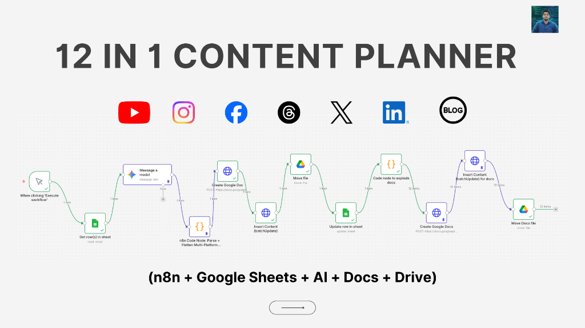

# 12-in-1 Content Planner (n8n workflow)

One topic in a Google Sheet in, a 12-format content pack out: an n8n workflow that asks Google Gemini for every
draft in one JSON payload and writes them to Google Docs, Drive and back to the sheet.



## What it does

You keep a list of topics in a Google Sheet. When you mark a row `READY` and run the workflow, it:

1. reads the topic title from the sheet,
2. sends one prompt to Google Gemini that asks for a strict JSON "content pack",
3. parses that JSON in a Code node,
4. creates one master Google Doc with every section, plus one Google Doc per format, in a Drive folder,
5. writes all 12 drafts into the sheet row and sets `Status` to `DONE`.

It writes drafts only. Nothing is posted or scheduled; you review and publish yourself.

**Why:** writing the same idea twelve ways for twelve formats is repetitive. This gets every first draft for a
topic into one place, in a consistent voice, so the time goes into editing.

## What you get per topic

| Channel | Formats |
|---|---|
| YouTube | Long video (6–9 min script, description, chapters, tags, pinned comment, thumbnail ideas), Short (45–60 s script, on-screen beats) |
| Instagram | Reel (35–45 s, 8–12 shots with timestamps and voiceover), Post caption, Carousel (exactly 10 slides) |
| Facebook | Post |
| Threads | Post |
| X / Twitter | Post, Thread |
| LinkedIn | Post, Article |
| Blog | Title, slug, TL;DR, meta title and description, HTML body, tags, image prompt |

That is 12 sheet columns and 13 Google Docs (12 per-format docs plus a master doc) per run. Reel voiceover and
Instagram captions are written in Hinglish; change the language rules in the prompt if you need something else.

## Architecture


```mermaid
flowchart LR
    T([Manual trigger]) --> R[Google Sheets:<br/>get READY rows]
    R --> G[Gemini:<br/>message a model]
    G --> P[Code: parse +<br/>flatten JSON]
    P --> D1[Docs API: create +<br/>fill master doc]
    D1 --> M1[Drive: move file]
    M1 --> U[Google Sheets:<br/>update row, DONE]
    U --> X[Code: explode<br/>12 doc jobs]
    X --> D2[Docs API: create +<br/>fill 12 docs]
    D2 --> M2[Drive: move files]
```

| Node | Type | Job |
|---|---|---|
| When clicking 'Execute workflow' | Manual Trigger | Starts a run |
| Get row(s) in sheet | Google Sheets | Reads rows where `Status = READY` |
| Message a model | Google Gemini (`models/gemini-3-pro-preview`) | Generates the JSON content pack |
| n8n Code Node: Parse + Flatten Multi-Platform JSON Payload | Code | Extracts the JSON, builds the master doc body and the 12 sheet values |
| Create Google Doc / Insert Content (batchUpdate) | HTTP Request → Google Docs API | Creates the master doc and inserts the text |
| Move file | Google Drive | Moves the master doc into your folder |
| Update row in sheet | Google Sheets | Writes the 12 columns, sets `Status` to `DONE` (matches on `Title`) |
| Code node to explode docs | Code | Turns the payload into 12 doc jobs |
| Create Google Docs / Insert Content (batchUpdate) for docs | HTTP Request → Google Docs API | Creates and fills one doc per format |
| Move Docs file | Google Drive | Moves each doc into your folder |

The full JavaScript for both Code nodes is inside the workflow JSON; open the node in n8n to read or edit it.

## Quick start

### Requirements

- n8n (self-hosted or n8n Cloud)
- A Google Cloud project with the **Google Sheets API**, **Google Drive API** and **Google Docs API** enabled
- An OAuth client whose consent screen allows these scopes:
  - `https://www.googleapis.com/auth/spreadsheets`
  - `https://www.googleapis.com/auth/drive`
  - `https://www.googleapis.com/auth/documents`
- A Google Gemini API key

### 1. Create the sheet

Make a Google Sheet with these column headers in row 1, spelled exactly like this:

```text
Title | Status | YouTube Long | Youtube Short | Instagram Reel | Instagram Post | Instagram Carousel | Facebook Post | Thread Post | Twitter Post | Twitter Thread | Linkedin Post | Linkedin Article | Blog Post
```

Add a topic in `Title` and set `Status` to `READY`.

### 2. Import the workflow

1. In n8n, create a new workflow and import `12 in 1 Content Planner (Complete).json`.
2. Create these credentials in n8n (names are n8n's credential types; no keys go in this repo):
   - Google Sheets OAuth2
   - Google Drive OAuth2
   - Google Docs OAuth2 (used by the four HTTP Request nodes)
   - Google Gemini (PaLM) API
3. Open both Google Sheets nodes and select **your** spreadsheet and sheet. The export still points at the
   author's sheet.
4. Open both Google Drive "Move" nodes and select **your** destination folder.

### 3. Run it

Click **Execute workflow**. When it finishes, the row says `DONE`, its 12 columns are filled, and the folder has
13 new Google Docs named after the topic.

## Customising the prompt

The prompt lives in the **Message a model** node. The `brand` block sets the channel name, promise and tone, and
`cta_keyword` / `lead_magnet` set the comment-to-get call to action. Change those first. The JSON shape must stay
as it is unless you also update both Code nodes.

<details>
<summary>Full system prompt (as used in the workflow)</summary>

```text
You are an expert automation content creator. Generate a complete "12 in 1 Content Planner" content pack for ONE topic.

IMPORTANT OUTPUT RULES (MUST FOLLOW):
1) Output ONLY valid JSON. No markdown. No commentary. No trailing commas.
2) Use double quotes for all strings. Use only: string/number/boolean/array/object.
3) Language:
   - Hinglish for Reel voiceover + IG captions (natural, not cringe).
   - Simple English for Carousel slides (clean, punchy).
   - LinkedIn + Blog can be professional English (calm, engineering-led).
4) Avoid false claims. If something is uncertain, phrase it as a suggestion.
5) Carousel: exactly 10 slides. Each slide body must fit on screen (max 180 characters).
6) Instagram Reel: 35–45 seconds, 8–12 shots, timestamps + on-screen captions. First 2 shots must show payoff/demo quickly. Include 1 shot for error handling/retry/approval. End with CTA keyword.
7) YouTube Long: provide full voiceover script (6–9 minutes) + title + description + chapters + tags + pinned comment + thumbnail text ideas.
8) YouTube Short: provide 45–60 sec script (hook-heavy) + on-screen text beats + description + hashtags.
9) Provide a "validation" object with simple checks so n8n can fail fast.

INPUT (from Google Sheet row):
{
  "topic": "${$json.Title}",
  "cta_keyword": "FLOW",
  "lead_magnet": "12-in-1 Content Planner n8n JSON",
  "brand": {
    "channel_name": "CodeITronics / Avnish",
    "promise": "Build once. Automate forever.",
    "tone": "calm, confident, engineering-led; no hype"
  }
}

Return this exact JSON shape (do not change keys):

{
  "meta": {
    "topic": "",
    "content_angle": "",
    "primary_pain": "",
    "big_payoff": "",
    "audience": "developers building automations",
    "cta_keyword": "",
    "lead_magnet": ""
  },

  "youtube": {
    "long": {
      "title": "",
      "hook_1_line": "",
      "outline_bullets": [],
      "script": "",
      "description": "",
      "chapters": [
        { "t": "0:00", "label": "Intro / Demo" }
      ],
      "tags": [],
      "pinned_comment": "",
      "thumbnail": {
        "text_options": [],
        "visual_concept": "",
        "composition_notes": ""
      }
    },
    "short": {
      "title": "",
      "script": "",
      "on_screen_beats": [],
      "description": "",
      "hashtags": []
    }
  },

  "instagram": {
    "reel": {
      "duration_sec": 40,
      "hook_text": "",
      "shots": [
        {
          "t_start": "0:00",
          "t_end": "0:03",
          "visual": "",
          "on_screen_text": "",
          "voiceover_hinglish": "",
          "sfx": ""
        }
      ],
      "caption_hinglish": "",
      "hashtags": [],
      "cta_line": ""
    },
    "post": {
      "caption_hinglish": "",
      "hashtags": [],
      "cta_line": ""
    },
    "carousel": {
      "cover": { "headline": "", "subheadline": "", "badge": "" },
      "slides": [
        { "slide_no": 1, "title": "", "body": "", "on_screen_caption": "" },
        { "slide_no": 2, "title": "", "body": "", "on_screen_caption": "" },
        { "slide_no": 3, "title": "", "body": "", "on_screen_caption": "" },
        { "slide_no": 4, "title": "", "body": "", "on_screen_caption": "" },
        { "slide_no": 5, "title": "", "body": "", "on_screen_caption": "" },
        { "slide_no": 6, "title": "", "body": "", "on_screen_caption": "" },
        { "slide_no": 7, "title": "", "body": "", "on_screen_caption": "" },
        { "slide_no": 8, "title": "", "body": "", "on_screen_caption": "" },
        { "slide_no": 9, "title": "", "body": "", "on_screen_caption": "" },
        { "slide_no": 10, "title": "", "body": "", "on_screen_caption": "" }
      ],
      "design": {
        "format": "1080x1350",
        "style": "minimal, dev aesthetic",
        "colors": {
          "bg": "#0B1220",
          "text": "#FFFFFF",
          "accent1": "#7C3AED",
          "accent2": "#22C55E",
          "warning": "#F59E0B"
        },
        "font_suggestions": ["Poppins", "Inter"],
        "layout_rules": [
          "Max 2 lines title",
          "Body max 3 short lines",
          "Use 1 highlight word per slide",
          "Keep safe margins 10%"
        ]
      }
    }
  },

  "facebook": { "post": { "text": "", "cta_line": "" } },

  "threads": { "post": { "text": "" } },

  "twitter": {
    "post": { "text": "" },
    "thread": { "tweets": [] }
  },

  "linkedin": {
    "post": { "text": "", "cta_line": "" },
    "article": { "title": "", "hook": "", "tldr": "", "body": "", "hashtags": [] }
  },

  "blog": {
    "title": "",
    "slug": "",
    "tldr": "",
    "meta_title": "",
    "meta_description": "",
    "html_body": "",
    "tags": [],
    "image_prompt": ""
  },

  "assets": {
    "screen_recording_list": [],
    "broll_ideas": [],
    "thumbnail": {
      "text_options": [],
      "visual_concept": "",
      "composition_notes": ""
    }
  },

  "validation": {
    "is_valid_json": true,
    "carousel_slides_count": 10,
    "reel_has_8_to_12_shots": true,
    "safe_to_publish": true,
    "warnings": []
  }
}

Rules for generating Reel shots:
- Provide 8–12 shots total.
- First 2 shots must show payoff/demos quickly.
- Include 1 shot for error handling/retry/approval.
- End with CTA: comment "FLOW" to get "12-in-1 Content Planner n8n JSON".

Return ONLY the JSON.
```

</details>

## Known limitations

- **One topic per run.** The parse node reads the first item only, so if several rows are `READY`, run the
  workflow once per topic (or add a Loop Over Items node).
- **Manual trigger only.** Add a Schedule Trigger node if you want it to run on its own.
- **Gemini output shape.** The parse node reads `content.parts[0].text` from the Gemini node. To use another model
  (OpenAI, DeepSeek), swap the model node and change that line.
- **Some per-format docs miss fields.** The "explode docs" node reads a few fields the prompt doesn't ask for
  (`youtube.short.on_screen_text` / `voiceover` / `shots`, `linkedin.article.sections` / `cta`, `blog.seo.*`,
  `twitter.thread.hook_tweet`), so those parts come out empty in the YouTube Short, LinkedIn Article, Blog and
  X Thread docs. The master doc and the sheet columns use the right fields.
- **No validation step.** The prompt asks the model for a `validation` object, but no node checks it yet, and
  there is no error branch. If Gemini returns invalid JSON, the parse node fails the run.
- **No publishing.** Image outputs are prompts and concepts only; nothing is sent to a social network or a
  scheduler.

## Files

| File | What it is |
|---|---|
| `12 in 1 Content Planner (Complete).json` | The n8n workflow export (import this) |
| `content-planner-overview.png` | Screenshot of the workflow |

## Demo

- Full tutorial on YouTube: [12-in-1 Content Planner Automation (n8n + Google Sheets + AI + Docs)](https://www.youtube.com/watch?v=wk8srFICvH4)
- Project write-up: _coming soon_ <!-- TODO: https://avnishyadav.com/projects/n8n-content-machine once published -->

## Hosting n8n

If you need somewhere to run n8n, Hostinger offers 20% off with my referral link:
[hostinger.in?REFERRALCODE=AVNISH](https://hostinger.in?REFERRALCODE=AVNISH) (referral link; I get a commission).

## License

No license has been chosen for this repository yet. <!-- TODO (owner): add a LICENSE file and update this line. -->

## Author

Built by **Avnish Yadav**, AI automation engineer.

- Website: [avnishyadav.com](https://avnishyadav.com)
- YouTube: [@avnishcodes](https://www.youtube.com/@avnishcodes)
- LinkedIn: [avnishyadav25](https://in.linkedin.com/in/avnishyadav25)
- GitHub: [avnishyadav25](https://github.com/avnishyadav25)
